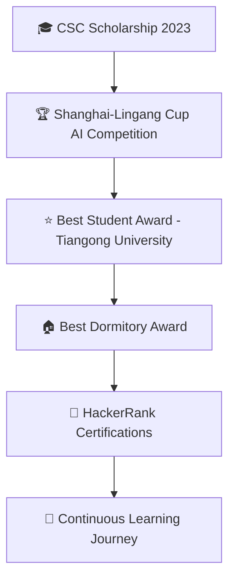

# 👋 Hi, I'm Md Obaidullah Bin Taher (Sameer)

<div align="center">


[](https://git.io/typing-svg)

</div>

---

<div align="center">

[](https://www.linkedin.com/in/sameerbintaher)
[](https://sameerbintaher.me/)
[](mailto:sameerbintaher@gmail.com)


</div>

---

## 🚀 About Me

```python
class Developer:
    def __init__(self):
        self.name = "Md Obaidullah Bin Taher (Sameer)"
        self.role = "Full-Stack Developer & AI Enthusiast"
        self.education = "Computer Science & Technology @ Tiangong University, China"
        self.languages = ["Python", "C++", "JavaScript", "Korean (Learning)"]
        self.current_focus = ["Computer Vision", "AI/ML", "Full-Stack Development"]
        self.fun_fact = "I turn coffee into code and ideas into reality! ☕→💻"
    
    def say_hi(self):
        print("Thanks for dropping by! Let's build something amazing together! 🚀")

me = Developer()
me.say_hi()
```

---

## 🛠️ Tech Arsenal

<div align="center">

### 💻 Languages & Frameworks


### 🗄️ Databases & Cloud


### 🔧 Tools & IDEs


</div>

---

## 🌟 Current Adventures

<div align="center">

| 🎯 Focus Area | 📚 Learning | 🔥 Status |
|:-------------:|:-----------:|:---------:|
| **Computer Vision & AI** | Advanced Image Quality Assessment | 🚀 Active |
| **Language Skills** | Korean Language 🇰🇷 | 📈 Progressing |
| **Full-Stack Development** | Next.js + Django Integration | 💡 Building |
| **Open Source** | Contributing to ML Projects | 🌱 Growing |

</div>

---

## 🏆 Achievements & Recognition

<div align="center">



</div>

### 📜 Certifications
- 🥇 **HackerRank JavaScript (Intermediate)**
- 🐍 **HackerRank Python (Basic)**
- 🧩 **HackerRank Problem Solving (Intermediate & Basic)**

---

## 📊 GitHub Analytics

<div align="center">


</div>

<div align="center">

[](https://git.io/streak-stats)

</div>

---

## 🎯 Fun Facts & Superpowers

<div align="center">

| 💡 Superpower | 🎯 Description |
|:-------------:|:-------------:|
| **🔮 Tech Visionary** | I see patterns where others see chaos |
| **🤖 Automation Wizard** | If it's repetitive, I'll automate it! |
| **🎨 Creative Coder** | Blending art with algorithms |
| **🌟 Team Catalyst** | Turning individual talents into collective magic |
| **☕ Coffee Compiler** | Converting caffeine into clean code |

</div>

---

## 🌐 Let's Connect & Collaborate!

<div align="center">

```ascii
    ╔══════════════════════════════════════╗
    ║  🚀 Ready to build something amazing? ║
    ║     Let's turn ideas into reality!     ║
    ╚══════════════════════════════════════╝
```

**Open to:**
- 💼 Full-time opportunities
- 🤝 Collaboration on exciting projects
- 💡 Innovative ideas and discussions
- 🌟 Open source contributions

</div>

---

<div align="center">

### 💭 Philosophy

*"The best way to predict the future is to create it."* - Peter Drucker


</div>

---

<div align="center">

**⭐ If you find my work interesting, don't forget to star my repositories! ⭐**

*Made with ❤️ and lots of ☕*

</div>
